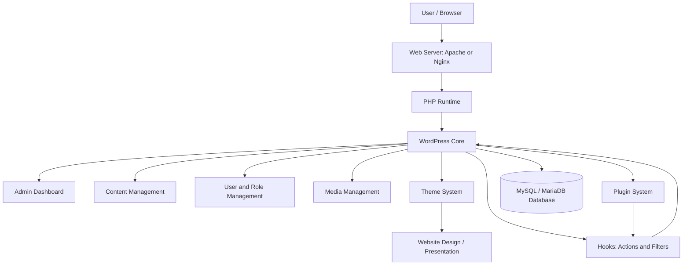
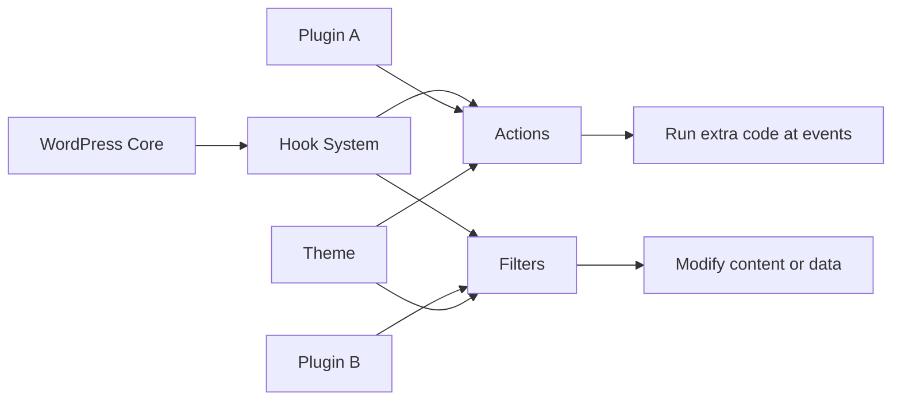
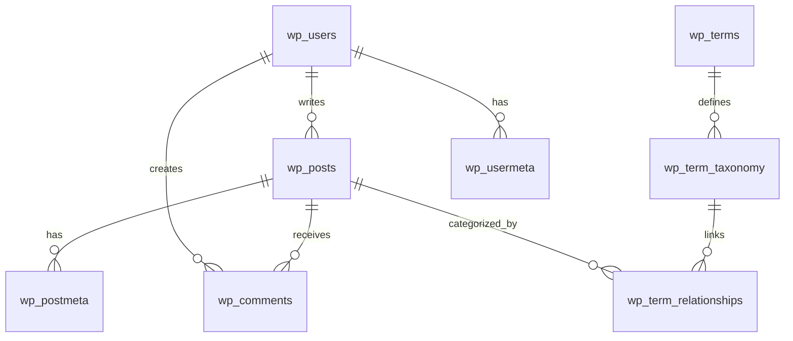
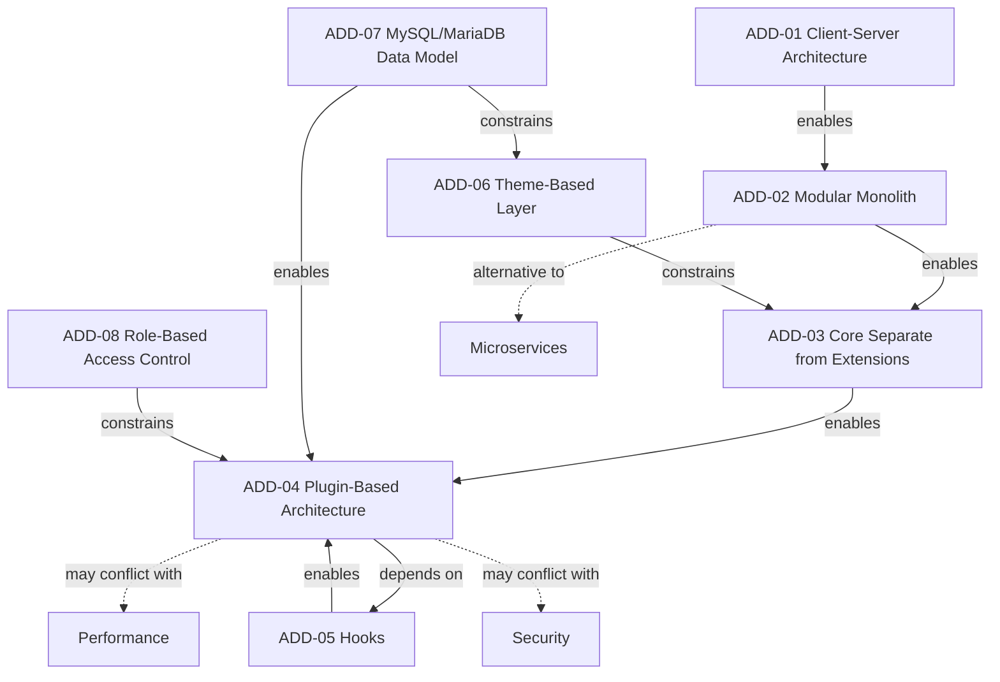

<div align="center">

# WordPress CMS Architecture Document

## Group Members

| # | Name | Student ID |
| :---: | :--- | :--- |
| 01 | **Umar Ajaib** | 2025272110001 |
| 02 | **Aqsa Fakhar Uddin** | 2025272110002 |

</div>

---

## Project Description

WordPress is a PHP-based Content Management System (CMS). It is used to create, manage, and publish website content such as posts, pages, images, comments, and user accounts. This project explains WordPress from a software architecture point of view.

The main focus of this document is the core WordPress architecture. WordPress is built around the WordPress Core, which handles content management, users, roles, themes, plugins, hooks, and database communication. WordPress follows more than one architecture style. It uses client-server architecture, modular monolith architecture, plugin-based architecture, and event-driven architecture through hooks.

A key idea in WordPress is that the core system should not be changed directly. Extra features are added through plugins, and the website design is changed through themes. WordPress stores its data in a MySQL or MariaDB database. This document explains the context, stakeholders, key drivers, architecture views, data model, design decisions, and relationships between design decisions.

---

## Table of Contents

- [1. Project Overview](#1-project-overview)
- [2. Context Diagram and Description](#2-context-diagram-and-description)
- [3. Stakeholders and Their Concerns](#3-stakeholders-and-their-concerns)
- [4. Key Architecture Drivers](#4-key-architecture-drivers)
- [5. Architecture Styles Used in WordPress](#5-architecture-styles-used-in-wordpress)
- [6. Architecture Views Chosen](#6-architecture-views-chosen)
- [7. Key Architecture Design Decisions](#7-key-architecture-design-decisions)
- [8. Relationships Between Architecture Design Decisions](#8-relationships-between-architecture-design-decisions)
- [9. Decision Relationship Diagram](#9-decision-relationship-diagram)
- [10. Conclusion](#10-conclusion)

---

# 1. Project Overview

WordPress is a web-based CMS. It allows users to build and manage websites without advanced programming knowledge. A user can create pages, write blog posts, upload images, manage comments, change themes, and install plugins from the admin dashboard.

WordPress works in a simple flow:

1. A user opens a WordPress website in a web browser.
2. The browser sends a request to the web server.
3. The web server runs PHP.
4. PHP executes the WordPress Core.
5. WordPress Core loads themes, plugins, hooks, and required data.
6. WordPress gets content from the MySQL/MariaDB database.
7. The final webpage is generated and shown to the user.

The most important parts of WordPress architecture are:

| Part | Simple Meaning |
|---|---|
| WordPress Core | The main system or brain of WordPress. |
| Themes | Control the design and layout of the website. |
| Plugins | Add extra features without changing the core. |
| Hooks | Allow plugins and themes to connect with WordPress events. |
| MySQL/MariaDB Database | Stores posts, pages, users, comments, settings, and metadata. |
| Admin Dashboard | Allows users to manage website content and settings. |
| Web Server | Runs WordPress using PHP and serves pages to users. |

The main goal of this document is to explain how WordPress is structured, why this architecture is useful, and what major design decisions are involved.

---

# 2. Context Diagram and Description

## 2.1 Context Diagram


## 2.2 Context Description

The context diagram shows WordPress CMS as the main system. It also shows the people and systems that interact with WordPress.

In this project, we separate two things:

| Type | Meaning | Examples |
|---|---|---|
| External Person | A human user who interacts with WordPress. | Site Visitor, Content Author, Site Administrator, Plugin Developer |
| External System | A technical system that supports WordPress. | Web Browser, Web Server, PHP Runtime, MySQL/MariaDB Database, Email Server |

The main users of WordPress are:

- **Site Visitor:** reads pages and posts on the public website.
- **Content Author:** creates and edits posts, pages, and media.
- **Site Administrator:** manages users, themes, plugins, settings, and security.
- **Plugin Developer:** creates plugins to add new functionality.

The main technical systems are:

- **Web Browser:** sends user requests and displays the final website.
- **Web Server:** receives requests and runs WordPress.
- **PHP Runtime:** executes WordPress code.
- **MySQL/MariaDB Database:** stores WordPress data.
- **Email Server:** sends emails such as password reset or notifications.

Optional integrations such as payment gateways, analytics tools, or SEO tools can be added through plugins. However, they are not part of the core WordPress architecture.

---

# 3. Stakeholders and Their Concerns

Stakeholders are people or groups who care about the WordPress system. Each stakeholder has different concerns.

| Stakeholder | Role in WordPress | Main Concerns |
|---|---|---|
| Site Visitor | Opens the website and reads content. | Website should be fast, easy to use, and secure. |
| Content Author | Creates and edits posts/pages. | Content editing should be simple and user-friendly. |
| Site Administrator | Manages the whole website. | Needs control over users, plugins, themes, backups, and security. |
| Plugin Developer | Builds plugins for extra features. | Needs clear hooks, plugin compatibility, and safe extension points. |
| Theme Developer | Builds website design. | Needs separation between content and presentation. |
| Website Owner | Owns the website or business. | Wants low cost, reliability, easy updates, and business growth. |
| Hosting Provider | Provides server environment. | Needs stable server, PHP support, database support, and good performance. |
| Security Team | Protects the website. | Needs secure login, role control, updates, backups, and monitoring. |

---

# 4. Key Architecture Drivers

Architecture drivers are the important reasons that influence architecture decisions.

| Key Driver | Easy Explanation | Impact on Architecture |
|---|---|---|
| Easy Content Management | Users should create and update content easily. | Requires admin dashboard, editor, media library, posts, and pages. |
| Extensibility | New features should be added without changing the core. | Requires plugins and hooks. |
| Customizable Design | Website look should be changeable. | Requires themes and templates. |
| Maintainability | WordPress should be easy to update and manage. | Requires separation of core, plugins, themes, and database. |
| Security | User accounts and admin area must be protected. | Requires login, roles, permissions, updates, and secure plugins. |
| Performance | Website should load quickly. | Requires efficient PHP execution, database optimization, caching, and careful plugin use. |
| Data Flexibility | WordPress must store different types of content. | Requires relational data model with posts, metadata, users, comments, and options. |
| Usability | Non-technical users should manage websites easily. | Requires simple dashboard and clear workflow. |

---

# 5. Architecture Styles Used in WordPress

WordPress does not use only one architecture style. It combines multiple architecture styles.

## 5.1 Client-Server Architecture

WordPress uses client-server architecture. The user uses a web browser as the client. The WordPress website runs on a server. The browser sends requests, and the server returns web pages.

Simple flow:

```text
Browser → Web Server → PHP → WordPress Core → Database → Web Page
```

## 5.2 Modular Monolith Architecture

WordPress Core is deployed as one main application. However, inside the application, different modules handle different responsibilities.

Examples of modules:

- Posts
- Pages
- Users
- Comments
- Media
- Themes
- Plugins
- Settings

This is called a modular monolith because it is one application but internally divided into modules.

## 5.3 Plugin-Based / Microkernel-Like Architecture

WordPress Core provides the basic services. Extra features are added through plugins. This is similar to microkernel architecture because the core remains small and stable, while plugins add extra functionality.

Example:

- Contact form plugin adds forms.
- SEO plugin adds SEO features.
- Security plugin adds protection.
- WooCommerce plugin adds e-commerce features.

These features are not built directly into the core.

## 5.4 Event-Driven Architecture through Hooks

WordPress uses hooks to allow plugins and themes to interact with the core.

There are two main types of hooks:

| Hook Type | Meaning |
|---|---|
| Actions | Run custom code when a specific event happens. |
| Filters | Modify data before it is displayed or saved. |

Example:

A plugin can use a hook to add extra text at the end of a blog post without changing WordPress Core.

---

# 6. Architecture Views Chosen

To explain WordPress architecture clearly, this document uses five architecture views.

| Architecture View | Purpose |
|---|---|
| Context View | Shows WordPress, users, and external systems. |
| Logical / Module View | Shows main WordPress modules. |
| Plugin and Hooks View | Shows how plugins extend WordPress using hooks. |
| Deployment View | Shows how WordPress runs on a server. |
| Data Model View | Shows how WordPress stores data in database tables. |

---

## 6.1 Context View


The context view shows the boundary of the WordPress system. It explains which users interact with WordPress and which technical systems support it.

---

## 6.2 Logical / Module View

The logical view shows the internal parts of WordPress.



Simple explanation:

- The browser sends a request.
- The web server runs PHP.
- PHP loads WordPress Core.
- WordPress Core communicates with themes, plugins, hooks, and database.
- The final page is displayed to the user.

---

## 6.3 Plugin and Hooks View

This view explains how WordPress can be extended without modifying the core.



Simple explanation:

Plugins and themes do not need to change WordPress Core. They connect to WordPress through hooks. This makes WordPress flexible and maintainable.

---

## 6.4 Deployment View


The deployment view shows how WordPress runs in a real hosting environment.

| Deployment Element | Responsibility |
|---|---|
| Web Browser | Used by visitors and admins to access WordPress. |
| Web Server | Handles HTTP/HTTPS requests. |
| PHP Runtime | Executes WordPress PHP code. |
| WordPress Core | Runs main CMS logic. |
| MySQL/MariaDB Database | Stores content, users, comments, settings, and metadata. |
| wp-content Folder | Stores themes, plugins, and uploaded files. |

Simple deployment flow:

```text
User Browser
   ↓
Web Server
   ↓
PHP Runtime
   ↓
WordPress Core
   ↓
MySQL/MariaDB Database
```

---

## 6.5 Data Model View

The data model is a key architecture design decision in WordPress. WordPress uses a relational database model with MySQL or MariaDB.



Important database tables:

| Table | Easy Explanation |
|---|---|
| `wp_posts` | Stores posts, pages, revisions, and media attachments. |
| `wp_postmeta` | Stores extra information about posts and pages. |
| `wp_users` | Stores website users. |
| `wp_usermeta` | Stores extra user information and roles. |
| `wp_comments` | Stores comments. |
| `wp_options` | Stores website settings. |
| `wp_terms` | Stores categories and tags. |
| `wp_term_taxonomy` | Defines category/tag type. |
| `wp_term_relationships` | Links posts with categories and tags. |

This data model is flexible because WordPress can store different types of content using common tables.

---

# 7. Key Architecture Design Decisions

This section documents key architecture decisions using the course template.

---

## ADD-01: Use Client-Server Architecture

| Template Item | Description |
|---|---|
| Issue | How should users access WordPress? |
| Importance | WordPress is a web system, so users need to access it through a browser. |
| Decision | Use client-server architecture. Browser is the client, and WordPress runs on the server. |
| Status | Accepted |
| Group | Architecture Style |
| Assumptions | Users have browsers and internet access. The server supports PHP and database. |
| Alternatives | Desktop CMS, mobile-only CMS, fully client-side system. |
| Arguments | This is suitable because WordPress is designed as a web-based CMS. |
| Implications | Website depends on server, network, and browser compatibility. |
| Possible Negative Impact on Quality | If the server is slow or down, users cannot access the website. |

---

## ADD-02: Use Modular Monolith Architecture

| Template Item | Description |
|---|---|
| Issue | Should WordPress be one application or many independent services? |
| Importance | WordPress should be easy to deploy and maintain. |
| Decision | Use modular monolith architecture. WordPress runs as one application but has internal modules. |
| Status | Accepted |
| Group | Architecture Style |
| Assumptions | Standard WordPress architecture is used. |
| Alternatives | Microservices, service-oriented architecture. |
| Arguments | WordPress Core is one PHP application but contains modules for posts, users, comments, media, themes, and plugins. |
| Implications | Deployment is simple and easier to manage. |
| Possible Negative Impact on Quality | Individual modules cannot be scaled separately like microservices. |

---

## ADD-03: Keep WordPress Core Separate from Extensions

| Template Item | Description |
|---|---|
| Issue | How should new features be added safely? |
| Importance | WordPress Core should remain updateable and stable. |
| Decision | Do not modify WordPress Core directly. Use plugins and themes for customization. |
| Status | Accepted |
| Group | Maintainability / Extensibility |
| Assumptions | Plugins and themes provide enough customization. |
| Alternatives | Modify core files directly, build custom CMS. |
| Arguments | Keeping the core unchanged makes updates safer. |
| Implications | Developers must follow WordPress extension rules. |
| Possible Negative Impact on Quality | Poor plugins or themes can still cause security or performance issues. |

---

## ADD-04: Use Plugin-Based Architecture

| Template Item | Description |
|---|---|
| Issue | How should extra functionality be added? |
| Importance | Different websites need different features. |
| Decision | Use plugins to add optional features. |
| Status | Accepted |
| Group | Extensibility |
| Assumptions | Plugin system is stable and supports required features. |
| Alternatives | Add all features into core, use external systems only. |
| Arguments | Plugins make WordPress flexible and customizable. |
| Implications | Users can install only the features they need. |
| Possible Negative Impact on Quality | Too many plugins can slow down the website or create conflicts. |

---

## ADD-05: Use Hooks for Event-Driven Extension

| Template Item | Description |
|---|---|
| Issue | How can plugins communicate with WordPress Core? |
| Importance | Plugins need a safe way to interact with core behavior. |
| Decision | Use WordPress hooks, including actions and filters. |
| Status | Accepted |
| Group | Event-Driven Architecture |
| Assumptions | Developers use standard hooks. |
| Alternatives | Direct core modification, hard-coded changes. |
| Arguments | Hooks allow plugins to add or modify behavior without changing core files. |
| Implications | WordPress becomes easier to extend. |
| Possible Negative Impact on Quality | Too many hooks or poorly written hook functions can make debugging difficult. |

---

## ADD-06: Use Theme-Based Presentation Layer

| Template Item | Description |
|---|---|
| Issue | How should website design be managed? |
| Importance | Design should be changeable without changing content. |
| Decision | Use WordPress themes for layout, templates, and styling. |
| Status | Accepted |
| Group | Presentation / Modifiability |
| Assumptions | Content and design should be separate. |
| Alternatives | Hard-code design in core, use separate frontend application. |
| Arguments | Themes allow website design to change while content stays the same. |
| Implications | Website owner can change the look easily. |
| Possible Negative Impact on Quality | Poor themes can affect speed, accessibility, and security. |

---

## ADD-07: Use MySQL/MariaDB Data Model

| Template Item | Description |
|---|---|
| Issue | How should WordPress store its data? |
| Importance | Data storage affects performance, flexibility, and maintainability. |
| Decision | Use WordPress standard MySQL/MariaDB relational data model. |
| Status | Accepted |
| Group | Data Model |
| Assumptions | WordPress needs to store posts, pages, users, comments, settings, and metadata. |
| Alternatives | NoSQL database, file-based storage, custom schema. |
| Arguments | MySQL/MariaDB is the standard and supported data storage for WordPress. |
| Implications | WordPress can store flexible content and metadata. |
| Possible Negative Impact on Quality | Poor database queries or too much metadata can reduce performance. |

---

## ADD-08: Use Role-Based Access Control

| Template Item | Description |
|---|---|
| Issue | How should WordPress control user permissions? |
| Importance | Different users should have different access levels. |
| Decision | Use role-based access control. |
| Status | Accepted |
| Group | Security |
| Assumptions | Admins, authors, editors, subscribers, and visitors need different permissions. |
| Alternatives | Same permissions for all users, custom permission system. |
| Arguments | RBAC is simple and suitable for CMS workflow. |
| Implications | Admin actions and content workflows are controlled. |
| Possible Negative Impact on Quality | Wrong role settings or insecure plugins can cause security risks. |

---

# 8. Relationships Between Architecture Design Decisions

Architecture decisions are connected to each other. One decision can enable, constrain, depend on, or conflict with another decision.

| Relationship ID | Decision A | Relationship | Decision B | Easy Explanation |
|---|---|---|---|---|
| REL-01 | Client-Server Architecture | Enables | Modular Monolith | Because WordPress runs on a server, it can work as one server-side application. |
| REL-02 | Modular Monolith | Enables | Core-Extension Separation | Since WordPress has one core, plugins and themes must stay separate from it. |
| REL-03 | Core-Extension Separation | Enables | Plugin-Based Architecture | If core is not changed, plugins are needed for new features. |
| REL-04 | Plugin-Based Architecture | Depends On | Hooks | Plugins need hooks to connect with WordPress Core. |
| REL-05 | Hooks | Enables | Plugin-Based Architecture | Hooks make plugins useful and flexible. |
| REL-06 | Theme-Based Layer | Constrains | Core-Extension Separation | Themes should change design, not core logic. |
| REL-07 | Data Model | Enables | Plugin-Based Architecture | Plugins can store extra data using metadata and options. |
| REL-08 | Role-Based Access Control | Constrains | Plugin-Based Architecture | Plugins must follow WordPress roles and permissions. |
| REL-09 | Plugin-Based Architecture | May Conflict With | Security | Bad plugins can create security risks. |
| REL-10 | Plugin-Based Architecture | May Conflict With | Performance | Too many plugins can slow down the website. |
| REL-11 | Data Model | Constrains | Theme-Based Layer | Themes display content based on how data is stored. |
| REL-12 | Modular Monolith | Alternative To | Microservices | WordPress standard architecture is not microservices. |

---

# 9. Decision Relationship Diagram



---

# 10. Conclusion

This document explains the architecture of WordPress CMS in a simple and structured way. It focuses on the real WordPress core architecture instead of optional third-party integrations.

WordPress works as a PHP-based CMS using client-server architecture, modular monolith structure, plugin-based extension, event-driven hooks, theme-based presentation, and MySQL/MariaDB data model.

The most important design idea is that WordPress Core should remain stable and should not be modified directly. Themes are used for design, and plugins are used for extra features. Hooks allow plugins and themes to connect with the core without changing it.

The key architecture decisions and their relationships show how WordPress supports flexibility, maintainability, extensibility, usability, and security.


