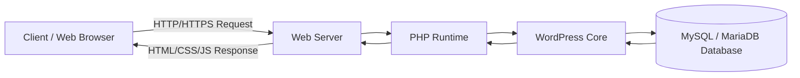
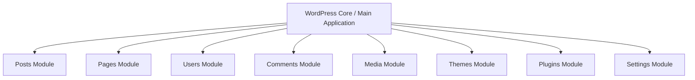
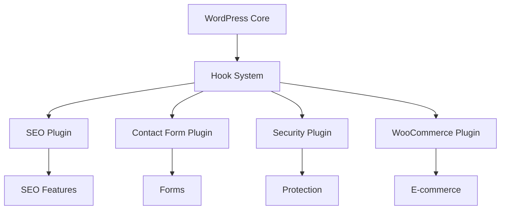
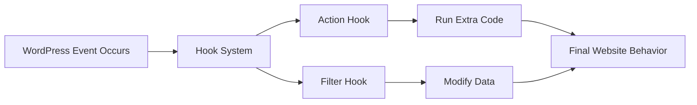
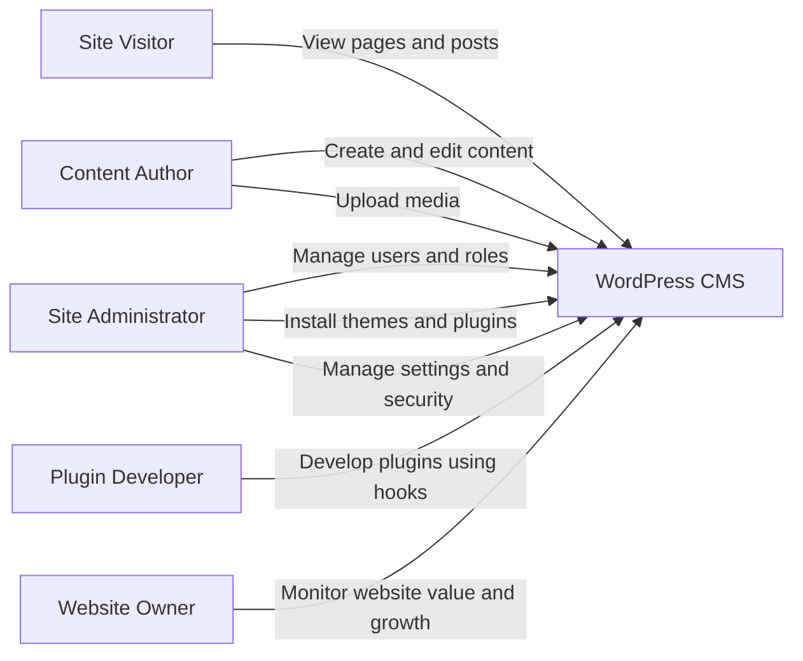
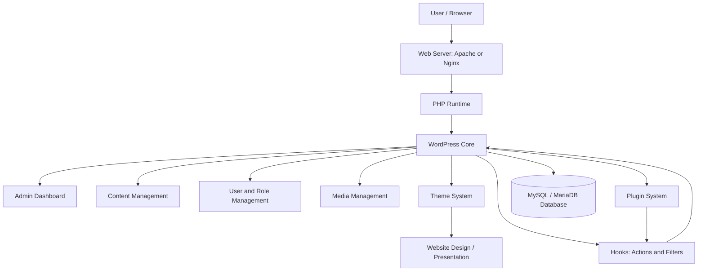
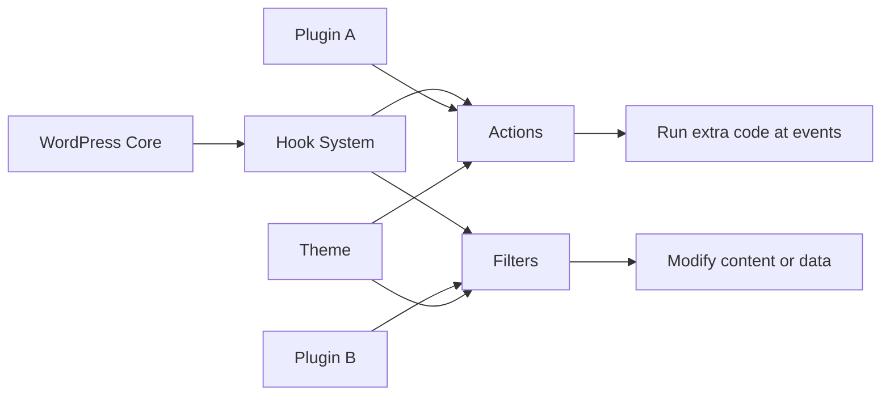
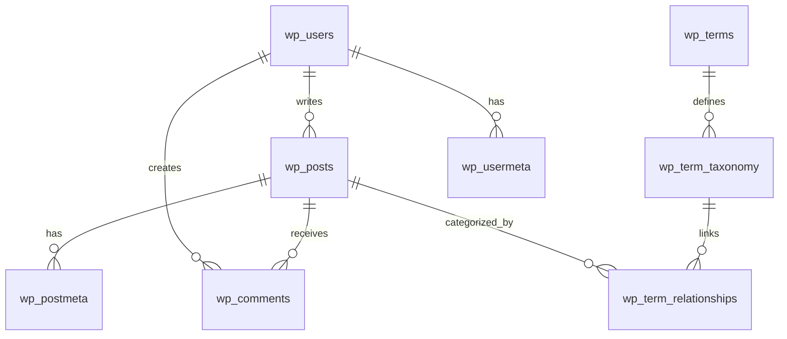
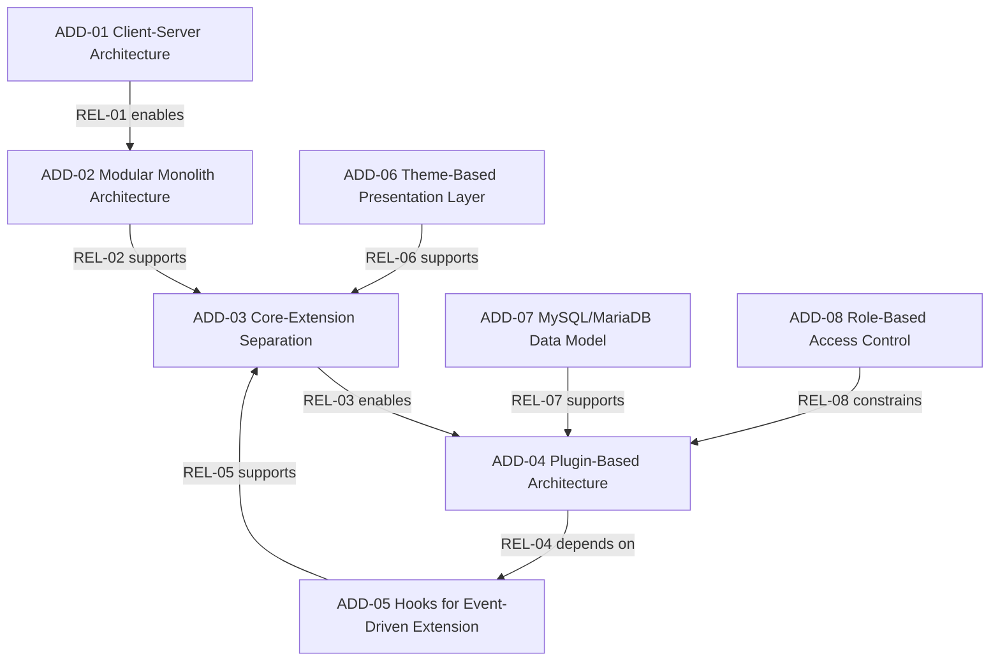

<div align="center">

# WordPress CMS Architecture Document

## Group Members

| # | Name | Student ID |
| :---: | :--- | :--- |
| 01 | **Umar Ajaib** | 2025272110001 |
| 02 | **Aqsa Fakhar Uddin** | 2025272110002 |

</div>

---

## Project Description

WordPress is a PHP-based Content Management System (CMS). It is used to create, manage, and publish website content such as posts, pages, images, comments, and user accounts. This project explains WordPress from a software architecture point of view.

The main focus of this document is the core WordPress architecture. WordPress is built around the WordPress Core, which handles content management, users, roles, themes, plugins, hooks, and database communication. WordPress follows more than one architecture style. It uses client-server architecture, modular monolith architecture, plugin-based architecture, and event-driven architecture through hooks.

A key idea in WordPress is that the core system should not be changed directly. Extra features are added through plugins, and the website design is changed through themes. WordPress stores its data in a MySQL or MariaDB database. This document explains the context, stakeholders, key drivers, architecture views, data model, design decisions, and relationships between design decisions.

---

## Table of Contents

- [1. Project Overview](#1-project-overview)
- [2. Context Diagram and Description](#2-context-diagram-and-description)
- [3. Stakeholders and Their Concerns](#3-stakeholders-and-their-concerns)
- [4. Key Architecture Drivers](#4-key-architecture-drivers)
- [5. Architecture Styles Used in WordPress](#5-architecture-styles-used-in-wordpress)
- [6. Architecture Views Chosen](#6-architecture-views-chosen)
- [7. Key Architecture Design Decisions](#7-key-architecture-design-decisions)
- [8. Relationships Between Architecture Design Decisions](#8-relationships-between-architecture-design-decisions)
- [9. Conclusion](#10-conclusion)

---

# 1. Project Overview

WordPress is a web-based CMS. It allows users to build and manage websites without advanced programming knowledge. A user can create pages, write blog posts, upload images, manage comments, change themes, and install plugins from the admin dashboard.

WordPress works in a simple flow:

1. A user opens a WordPress website in a web browser.
2. The browser sends a request to the web server.
3. The web server runs PHP.
4. PHP executes the WordPress Core.
5. WordPress Core loads themes, plugins, hooks, and required data.
6. WordPress gets content from the MySQL/MariaDB database.

The most important parts of WordPress architecture are:

| Part | Simple Meaning |
|---|---|
| WordPress Core | The main system or brain of WordPress. |
| Themes | Control the design and layout of the website. |
| Plugins | Add extra features without changing the core. |
| Hooks | Allow plugins and themes to connect with WordPress events. |
| MySQL/MariaDB Database | Stores posts, pages, users, comments, settings, and metadata. |
| Admin Dashboard | Allows users to manage website content and settings. |
| Web Server | Runs WordPress using PHP and serves pages to users. |

The main goal of this document is to explain how WordPress is structured, why this architecture is useful, and what major design decisions are involved.

---

# 2. Context Diagram and Description

## 2.1 Context Diagram


## 2.2 Context Description

The context diagram shows WordPress CMS as the main system. It also shows the people and systems that interact with WordPress.

In this project, we separate two things:

| Type | Meaning | Examples |
|---|---|---|
| External Person | A human user who interacts with WordPress. | Site Visitor, Content Author, Site Administrator, Plugin Developer |
| External System | A technical system that supports WordPress. | Web Browser, Web Server, PHP Runtime, MySQL/MariaDB Database, Email Server |

The main users of WordPress are:

- **Site Visitor:** reads pages and posts on the public website.
- **Content Author:** creates and edits posts, pages, and media.
- **Site Administrator:** manages users, themes, plugins, settings, and security.
- **Plugin Developer:** creates plugins to add new functionality.

The main technical systems are:

- **Web Browser:** sends user requests and displays the final website.
- **Web Server:** receives requests and runs WordPress.
- **PHP Runtime:** executes WordPress code.
- **MySQL/MariaDB Database:** stores WordPress data.
- **Email Server:** sends emails such as password reset or notifications.

Optional integrations such as payment gateways, analytics tools, or SEO tools can be added through plugins. However, they are not part of the core WordPress architecture.

---

# 3. Stakeholders and Their Concerns

Stakeholders are people or groups who care about the WordPress system. Each stakeholder has different concerns.

| Stakeholder        | Role in WordPress                    | Main Concerns                                                             |
| ------------------ | ------------------------------------ | ------------------------------------------------------------------------- |
| Site Visitor       | Opens the website and reads content. | Website should be fast, easy to use, and secure.                          |
| Content Author     | Creates and edits posts/pages.       | Content editing should be simple and user-friendly.                       |
| Site Administrator | Manages the whole website.           | Needs control over users, plugins, themes, backups, and security.         |
| Plugin Developer   | Builds plugins for extra features.   | Needs clear hooks, plugin compatibility, and safe extension points.       |
| Theme Developer    | Builds website design.               | Needs separation between content and presentation.                        |
| Website Owner      | Owns the website or business.        | Wants low cost, reliability, easy updates, and business growth.           |
| Hosting Provider   | Provides server environment.         | Needs stable server, PHP support, database support, and good performance. |
| Security Team      | Protects the website.                | Needs secure login, role control, updates, backups, and monitoring.       |

The stakeholders listed above influence many of the architectural decisions in WordPress. For example, administrators require security and manageability, developers need extensibility through plugins and hooks, while visitors expect good performance and usability. Understanding these concerns helps explain why WordPress uses a modular, extensible, and secure architecture.


# 4. Key Architecture Drivers

Architecture drivers are the important reasons that influence architecture decisions.

| Key Driver              | Easy Explanation                                                    | Impact on Architecture                                                                     |
| ----------------------- | ------------------------------------------------------------------- | ------------------------------------------------------------------------------------------ |
| Easy Content Management | Users should create and update content easily.                      | Requires admin dashboard, editor, media library, posts, and pages.                         |
| Extensibility           | New features should be added without changing the core.             | Requires plugins and hooks.                                                                |
| Customizable Design     | Website look should be flexible and adaptable for different brands. | Requires themes, templates, and styling support.                                           |
| Security                | User accounts, roles, and admin area must be protected.             | Requires login controls, permissions, secure plugins, and update mechanisms.               |
| Performance             | Website should load quickly and handle multiple users efficiently.  | Requires optimized PHP execution, database queries, caching, and careful plugin selection. |

These architecture drivers directly influence the design of WordPress. Easy content management led to the development of the admin dashboard and content management features. Extensibility is achieved through plugins and hooks, while customizable design is supported through themes and templates. Security requirements resulted in role-based access control and update mechanisms, whereas performance requirements encourage efficient database usage, caching, and optimized server-side processing.


# 5. Architecture Styles Used in WordPress

WordPress does not use only one architecture style. It combines multiple architecture styles to support flexibility, maintainability, extensibility, and security. The following figures show how each architecture style is used in the WordPress architecture design.

---

## 5.1 Client-Server Architecture

WordPress uses client-server architecture. The user accesses the website through a web browser, while WordPress runs on the server side. The browser sends a request, and the server processes it using PHP, WordPress Core, and the database.



The figure illustrates the flow of communication between the client and the server in WordPress. The client device hosts the web browser, which sends HTTP/HTTPS requests to the web server. On the server side, the PHP Runtime executes the WordPress Core, which retrieves or stores data in the MySQL/MariaDB database. After processing the request, the server generates an HTML/CSS/JavaScript response and sends it back to the client browser for display.

This figure shows how the browser acts as the client, while the web server, PHP runtime, WordPress Core, and database work together on the server side to deliver website content.


## 5.2 Modular Monolith Architecture

WordPress follows a modular monolith structure. It is deployed as one main application, but internally it is divided into different modules. Each module handles a specific responsibility.



This figure shows that WordPress works as one main application, but its internal responsibilities are divided into modules such as posts, users, comments, media, themes, plugins, and settings.

---

## 5.3 Plugin-Based / Microkernel-Like Architecture

WordPress also uses a plugin-based architecture, which is similar to a microkernel style. WordPress Core provides the basic services, while plugins add optional features without directly modifying the core.



This figure shows how plugins extend WordPress functionality through the hook system without changing WordPress Core directly.

---

## 5.4 Event-Driven Architecture through Hooks

WordPress uses hooks as an event-driven mechanism. Hooks allow plugins and themes to react to WordPress events or modify data during execution.

There are two main types of hooks:

| Hook Type | Meaning |
|---|---|
| Actions | Run custom code when a specific event happens. |
| Filters | Modify data before it is displayed or saved. |


This figure shows that when an event occurs in WordPress, hooks allow plugins or themes to run extra code or modify data safely.

Overall, these architecture styles work together in WordPress. Client-server architecture supports web access, modular monolith keeps the system organized, plugin-based architecture supports extensibility, and event-driven hooks allow safe communication between WordPress Core, plugins, and themes.

---

# 6. Architecture Views Chosen

## 6.1 Use Case View

The use case view explains the main functions of WordPress from the users’ perspective. It shows what different actors can do in the system.

Main actors include:

- Site Visitor
- Content Author
- Site Administrator
- Plugin Developer
- Website Owner

Main use cases include:

- View website content
- Create and edit posts/pages
- Upload and manage media
- Manage users and roles
- Install and configure themes
- Install and configure plugins
- Extend functionality through hooks
- Manage website settings and security



---

## 6.2 Context View


The context view defines the scope and boundary of the WordPress Content Management System (CMS). It illustrates how different external users and supporting technical systems interact with the platform.

The primary users of the system include administrators, content authors, editors, and website visitors. Administrators manage the overall configuration, user permissions, themes, and plugins. Authors and editors create, modify, review, and publish website content, while visitors access and consume the published information through a web browser.

The WordPress CMS also interacts with several external technical systems, such as the web hosting server, database server, email services, third-party plugins, themes, and external APIs. These supporting components enable content storage, authentication, communication, customization, and additional functionality.

This context view provides a high-level understanding of the system environment by showing the relationships between WordPress and its external entities without exposing internal implementation details.

---

## 6.3 Logical / Module View

The logical view shows the internal parts of WordPress.



Simple explanation:

- The browser sends a request.
- The web server runs PHP.
- PHP loads WordPress Core.
- WordPress Core communicates with themes, plugins, hooks, and database.
- The final page is displayed to the user.

---

## 6.4 Plugin and Hooks View

This view illustrates how WordPress supports extensibility through its plugin and hook mechanism without requiring modifications to the core system.



The hook system serves as an extension layer between the WordPress core and external components such as plugins and themes. It enables developers to add or customize functionality while preserving the integrity of the core codebase.

WordPress provides two types of hooks:

* Actions allow plugins and themes to execute custom code when specific events occur within the system.
* Filters allow plugins and themes to modify content, data, or output before it is displayed or stored.

Plugins and themes interact with the hook system rather than directly changing the WordPress core. This approach promotes loose coupling, simplifies maintenance, supports safe system updates, and improves scalability and reusability.

Simple explanation:

Plugins and themes do not need to modify the WordPress core. Instead, they connect to predefined hooks to add new functionality or modify existing behaviour. This design makes WordPress flexible, maintainable, and easy to extend.


## 6.5 Deployment View


The deployment view shows how WordPress CMS is deployed in a cloud hosting environment. Site Visitors and Content Authors/Administrators access the website through a web browser using HTTP and HTTPS requests. Requests first pass through the Internet or DNS layer, which resolves the domain name, and then through the CDN or WAF layer, which caches static content and filters traffic for security. A Load Balancer distributes incoming requests across multiple WordPress instances to improve scalability and availability.

The WordPress application is deployed on multiple Web Server/WordPress instances running Apache or Nginx, PHP, and WordPress. These instances process website requests and administrative operations. Shared Media Storage stores uploaded images, videos, and documents, while the Redis Cache Layer improves performance by caching frequently used data and sessions. The MySQL or MariaDB Database stores website content, pages, posts, users, comments, and configuration settings. External services such as SMTP/Email Service, OAuth Provider, Payment Gateway, and Backup/Monitoring Service integrate with WordPress to provide notifications, authentication, payment processing, backups, and system monitoring. The deployment architecture ensures scalability, high availability, performance, and reliability.

| Deployment Element     | Responsibility                                           |
| ---------------------- | -------------------------------------------------------- |
| Web Browser            | Used by visitors and admins to access WordPress.         |
| Web Server             | Handles HTTP/HTTPS requests.                             |
| PHP Runtime            | Executes WordPress PHP code.                             |
| WordPress Core         | Runs main CMS logic.                                     |
| MySQL/MariaDB Database | Stores content, users, comments, settings, and metadata. |
| wp-content Folder      | Stores themes, plugins, and uploaded files.              |

Simple deployment flow:

```text
User Browser
   ↓
Internet / DNS
   ↓
CDN / WAF
   ↓
Load Balancer
   ↓
WordPress Web Server Instances
   ↓
Cache Layer (Redis)
   ↓
MySQL / MariaDB Database
```


## 6.6 Data Model View

The data model is a key architecture design decision in WordPress. WordPress uses a relational database model with MySQL or MariaDB.



Important database tables:

| Table | Easy Explanation |
|---|---|
| `wp_posts` | Stores posts, pages, revisions, and media attachments. |
| `wp_postmeta` | Stores extra information about posts and pages. |
| `wp_users` | Stores website users. |
| `wp_usermeta` | Stores extra user information and roles. |
| `wp_comments` | Stores comments. |
| `wp_options` | Stores website settings. |
| `wp_terms` | Stores categories and tags. |
| `wp_term_taxonomy` | Defines category/tag type. |
| `wp_term_relationships` | Links posts with categories and tags. |

This data model is flexible because WordPress can store different types of content using common tables.

---

# 7. Key Architecture Design Decisions

This section documents the main architecture decisions in WordPress. Each decision includes clear **Issue**, **Importance**, **Decision**, **Arguments**, **Positive Impact**, and **Negative Impact** for clarity.

---

## ADD-01: Use Client-Server Architecture

| Template Item | Description |
|---|---|
| Issue | How should users access WordPress CMS? |
| Importance | Visitors, content authors, and administrators need reliable, cross-platform web access. |
| Decision | Use a client-server architecture: the browser acts as the client, and WordPress runs on the server. |
| Arguments | This approach allows users to access WordPress from any device without installing software. Requests are processed securely on the server, separating frontend access from backend logic. |
| Positive Impact | Easy access from multiple devices, simplifies deployment and maintenance, supports scalability for small to medium sites. |
| Negative Impact | Server downtime or network issues can prevent access; performance depends on server configuration and network speed. |

---

## ADD-02: Use Modular Monolith Architecture

| Template Item | Description |
|---|---|
| Issue | Should WordPress be structured as one application or multiple independent services? |
| Importance | Ensures maintainability and simplifies deployment. |
| Decision | Deploy WordPress as a modular monolith: one application with internal modules for posts, users, comments, media, themes, plugins, and settings. |
| Arguments | A monolith keeps deployment simple while separating logical responsibilities internally. Easier for administrators to maintain one cohesive system. |
| Positive Impact | Simplifies deployment, maintainable, modules are internally separated for clarity. |
| Negative Impact | Cannot scale individual modules independently; a failure in one module may impact the whole system. |

---

## ADD-03: Keep WordPress Core Separate from Extensions

| Template Item | Description |
|---|---|
| Issue | How can new features be added safely without affecting WordPress Core? |
| Importance | Maintaining system stability and updateability. |
| Decision | Do not modify WordPress Core directly. Add new features via plugins and themes. |
| Arguments | Separating core and extensions ensures updates do not break customizations and preserves stability. |
| Positive Impact | Maintains core integrity, safer updates, extensibility through plugins/themes. |
| Negative Impact | Poorly coded plugins/themes can still introduce performance, security, or compatibility issues. |

---

## ADD-04: Use Plugin-Based Architecture

| Template Item | Description |
|---|---|
| Issue | How can WordPress support optional features for different websites? |
| Importance | Websites require different functionalities such as SEO, forms, analytics, or e-commerce. |
| Decision | Use plugin-based architecture to allow optional features without modifying core. |
| Arguments | Plugins provide flexibility, customization, and isolation of features without affecting the core system. |
| Positive Impact | Increases flexibility and functionality; users can install only needed features. |
| Negative Impact | Excessive plugins can reduce performance, create conflicts, or introduce vulnerabilities. |

---

## ADD-05: Use Hooks for Event-Driven Extension

| Template Item | Description |
|---|---|
| Issue | How can plugins safely interact with WordPress Core? |
| Importance | Ensures modular extensions can execute code without modifying the core. |
| Decision | Implement hooks (actions and filters) for event-driven communication. |
| Arguments | Hooks allow extensions to react to events and modify behavior safely and flexibly. |
| Positive Impact | Supports extensibility and maintainability, reduces direct code changes in the core. |
| Negative Impact | Poorly written hooks can make debugging difficult and may affect performance. |

---

## ADD-06: Use Theme-Based Presentation Layer

| Template Item | Description |
|---|---|
| Issue | How should website design be managed? |
| Importance | Design must be flexible without changing content or core logic. |
| Decision | Use WordPress themes for layout, templates, and styling. |
| Arguments | Themes separate content from presentation, allowing easy design updates and brand customization. |
| Positive Impact | Improves modifiability, usability, and aesthetic flexibility. |
| Negative Impact | Poorly coded themes can impact performance, accessibility, and security. |

---

## ADD-07: Use MySQL/MariaDB Data Model

| Template Item | Description |
|---|---|
| Issue | How should WordPress store content, users, and metadata? |
| Importance | Database design affects performance, maintainability, and flexibility. |
| Decision | Use relational database (MySQL/MariaDB) as standard WordPress storage. |
| Arguments | Relational DB provides structured storage, easy queries, and consistent data relationships. |
| Positive Impact | Efficient data storage, supports content, users, and plugin metadata; reliable and scalable. |
| Negative Impact | Poorly optimized queries or too much metadata can degrade performance. |

---

## ADD-08: Use Role-Based Access Control

| Template Item | Description |
|---|---|
| Issue | How should WordPress control user permissions securely? |
| Importance | Users have different responsibilities; proper access control is critical for security. |
| Decision | Implement RBAC with predefined roles: Admin, Editor, Author, Contributor, Subscriber. |
| Arguments | RBAC ensures each user has only necessary permissions, reducing risks of unauthorized actions. |
| Positive Impact | Enhances security, workflow control, and accountability. |
| Negative Impact | Misconfigured roles or insecure plugins can still pose security threats. |

---

# 8. Relationships Between Architecture Design Decisions

Architecture decisions in WordPress are not separate from each other. Each decision supports, depends on, or constrains another decision. These relationships help explain how the overall WordPress architecture works as one complete system.

| Relationship ID | Decision A                              | Relationship | Decision B                              | Explanation                                                                                                             |
| --------------- | --------------------------------------- | ------------ | --------------------------------------- | ----------------------------------------------------------------------------------------------------------------------- |
| REL-01          | ADD-01 Client-Server Architecture       | Enables      | ADD-02 Modular Monolith Architecture    | Because WordPress runs on a server, it can be deployed as one server-side application with internal modules.            |
| REL-02          | ADD-02 Modular Monolith Architecture    | Supports     | ADD-03 Core-Extension Separation        | Since WordPress has one central core, plugins and themes are kept separate to protect the stability of the core system. |
| REL-03          | ADD-03 Core-Extension Separation        | Enables      | ADD-04 Plugin-Based Architecture        | Because the core should not be modified directly, plugins are used to add new features safely.                          |
| REL-04          | ADD-04 Plugin-Based Architecture        | Depends On   | ADD-05 Hooks for Event-Driven Extension | Plugins need hooks to communicate with WordPress Core and run functionality at specific events.                         |
| REL-05          | ADD-05 Hooks for Event-Driven Extension | Supports     | ADD-03 Core-Extension Separation        | Hooks allow plugins and themes to extend WordPress without changing the core files.                                     |
| REL-06          | ADD-06 Theme-Based Presentation Layer   | Supports     | ADD-03 Core-Extension Separation        | Themes manage design and layout separately, so visual changes do not affect WordPress Core logic.                       |
| REL-07          | ADD-07 MySQL/MariaDB Data Model         | Supports     | ADD-04 Plugin-Based Architecture        | Plugins can store extra settings, metadata, and configuration data using WordPress database tables.                     |
| REL-08          | ADD-08 Role-Based Access Control        | Constrains   | ADD-04 Plugin-Based Architecture        | Plugins must follow WordPress user roles and permissions to avoid unauthorized access and security risks.               |

These relationships show that WordPress architecture is connected and balanced. The client-server model allows WordPress to run as a server-side application. The modular monolith structure keeps the system simple, while core-extension separation protects the main WordPress Core. Plugins and hooks provide extensibility, themes handle presentation, the database supports content and plugin data, and role-based access control protects the system from unauthorized actions.

The following diagram provides a visual overview of the relationships between the Architecture Design Decisions (ADDs) described above.



The diagram summarizes how the major architecture decisions influence one another and collectively shape the overall WordPress architecture.


# 9. Conclusion

This document explains the architecture of WordPress CMS in a simple and structured way. It focuses on the real WordPress core architecture instead of optional third-party integrations.

WordPress works as a PHP-based CMS using client-server architecture, modular monolith structure, plugin-based extension, event-driven hooks, theme-based presentation, and MySQL/MariaDB data model.

The most important design idea is that WordPress Core should remain stable and should not be modified directly. Themes are used for design, and plugins are used for extra features. Hooks allow plugins and themes to connect with the core without changing it.

The key architecture decisions and their relationships show how WordPress supports flexibility, maintainability, extensibility, usability, and security.


